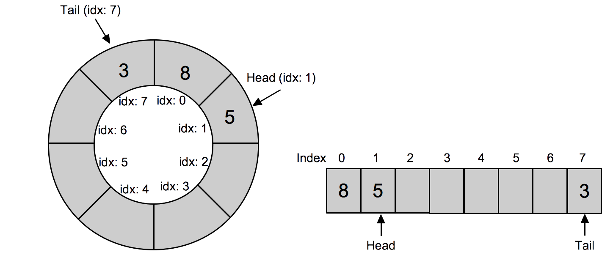
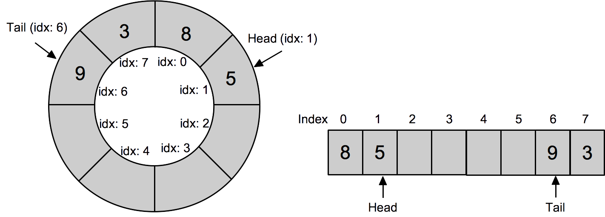
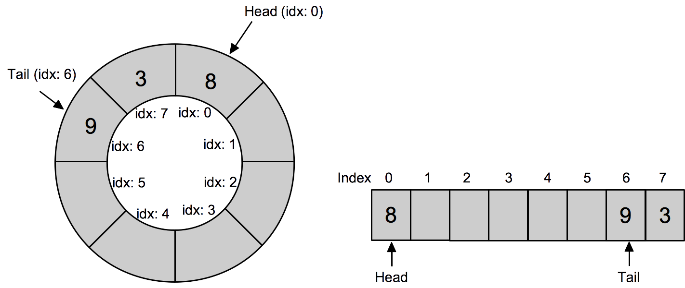

Instructions - Laboratory assignment 1803c-ht18
======

_Johan Holmgren, 2018-09-14_

Overview and purpose of task
----

The purpose of this assignment is that you should learn about buffers, which is a useful data structure in embedded systems. In particular, you will implement a first-in-first-out queue using a circular buffer. 

In addition, you will learn how to implement your own test cases using the unity test tool (see [http://www.throwtheswitch.org/unity](http://www.throwtheswitch.org/unity)), using the knowledge you gained in the previous course assignments and in the lecture about test-driven development. 

You will conduct this assignment in pairs of two students; however, in exceptional cases it is also possible to work individually. 


Preparation 
------

Before the scheduled laboratory assignment you should complete the following steps:

* Study the powerpoint material about buffers.
* Read this assignment specification before the scheduled laboratory session. It is recommended to start working with this assignment before the scheduled laboratory session, since it will most likely take longer than 8 hours to complete this assignment.   
* Read the 'Cygwin' and  'Hello world using Cygwin' parts of the 'DA267A - Laboratory environment' document, which you find on the Canvas course page. 
* Study the lecture material about test test-driven development. 
* Read the report *UNITY: A LIGHTWEIGHT C TEST HARNESS FOR EMBEDDED SYSTEMS*, which you find under **Moduler > Föreläsningar > F2 ... ** on the Canvas course page.  


We will provide a sample make file for the assignment, which contains two main targets: build_unity_test and clean. 
The 'build_unity_test' target compiles your program, and the 'clean' target removes all the binary files that are generated during compilation and linkin. Please note that it is common practice to not add compiled files to git repositories


Introduction to circular buffers
------

A circular buffer is a data type, which can be described as a fixed size buffer whose start and end are connected to form a circle. 
A circular buffer is typically implemented using a normal array, where the elements that are currently represented in the buffer are stored in sequence somewhere in the array. 
An important feature of a circular buffer is that the sequence of elements can start and end anywhere in the array. 
A circular buffer is typically implemented using two pointers (head and tail) that defines which positions in the array is currently used to store data.  


A typical use of a circular buffer in embedded system is to represent a queue, for example, in order to store input from a sensor that is handled in a _first-come-first-served_ manner by the system. When adding and removing elements, the queue will obviously change size, and more importantly, it moves around in a circular way. It should be emphasized that elements are always added to the tail and removed at the head. 

Using the queue terminology, *tail* points to the most recently added element, i.e., the last element in a first-come-first-served queue, and *head* points to the oldest element in the queue, i.e., the first element in a first-come-first-served queue.

The following image illustrates a circular buffer queue with the values 5 (the first element), 8, and 3 (the last element). 



The following image shows what happens when we add the element 9 to the buffer/queue. 



Finally, the following image shows what happens when we remove the element at the head. 



Please note what happens with the head and tail pointers when we add and remove elements. By studying the images you can also see how the sequence of elements moved one step to left when adding and removing one element. 


Description of task
------

Your task in this laboratory assignment is to implement a number of functions that allow you to work with a circular buffer containing `int` values. 
You are given a header file `circular_buffer.h`, which specifies all of the functions you should implement. 
In addition, you will implement a number of test cases using the unity test framework.


### Create and clone your assignment git repository
The first thing you need to do is to create your group's git repository for this assignment and clone your repository to your local computer. 

In your git repository you find two folders: `Instructions` and `task`. In the instructions folder you find this assignment instruction, and in the task folder you find all the code needed to work with this assignment. 

In particular, the task folder contains a makefile and four subfolders: `src`, `bin`, `test`, and `unity`. 


* The `src`folder contains the `circular_buffer.h` header file and an empty `circular_buffer.c` file, which you will modify. 
* All the compiled code will be saved in the `bin` folder if you use the provided makefile. 
* You will create your test cases in the `test` folder.
* You find the unit framework in the `unity folder`.


### Implement a circular buffer

As mentioned above, you are provided a c header file `circular_buffer.h`, which contains a circular buffer data structure and a number of function declarations. 

The circular buffer data structure is defined in the following way:

```
struct circularBuffer{
  int * data;
  int head;
  int tail;
  int maxLength;
};
```

Given the description above about a circular buffer queue, you should implement the following functions, which are declared in`circular_buffer.h`.

* `void initCircularBuffer()`
* `int contains()`
* `int addElement()`
* `int removeValue()`
* `int removeHead()`

Specifications of each of these functions are given below.


An important problem you need to solve is the "empty or full" problem. 
You implement your circular buffer using head and tail, which will point to the same place in the array both when the buffer is full and when the buffer is empty. 
As part of the assignment you should identify a solution for this problem. 
Please note that this means that you might need to make some changes to the `struct circularBuffer` data structure. 


Another problem is to decide what to do when the circular buffer is full. In particular, when you need to add an element to a buffer that is already full you need to decide whether you should overwrite one element in the buffer or if you should discard the element that you are about to add. 
If you decide to overwrite an existing element, you also need to decide if you should overwrite the element at the tail or at the head. 
During examination, you should be able to motivate your approach of how to manage the problem having full buffer. 


For this task, you can assume that there will be always sufficient amount of memory available for your buffer. However, in an embedded system, you need to check that your buffer does not use more memory than you have, and that you do not use memory addresses that are used for other purposes. 


Please note that you are recommended to test, using pen and paper, what will happen to your circular buffer when you run the operations you will implement in your functions. 
This might help you understand how to write your code. 


##### Function: void initCircularBuffer()

Function declaration: 

	void initCircularBuffer(struct circularBuffer* bufferPtr, int* data, int maxLen);

This function is used to initalize the buffer using a statically allocated array of integers.

This function is already implemented in the code you "downloaded" from git.
 

##### Function: int contains()
 
Function declaration: 
 
	int contains(struct circularBuffer* bufferPtr, int value); 
 
This function should check if the buffer pointed to by `bufferPtr` contains at least one element with the value specified by the `value` argument.

The function should return:

*	`value` if an element with the input value was found in the buffer
*   `INT_MIN` (defined in `limits.h`) if no element with the argument value was not found.


##### Function: int addElement()

Function declaration: 

	int addElement(struct circularBuffer* bufferPtr, int value);


This function should add the value specified by the `value` argument at the tail of the buffer.

The function should return:

* `value` if the value was successfully added to the buffer.
*  `INT_MIN` (defined in `limits.h`) if the value was not  added.


##### Fuction: int removeValue()

Function declaration: 
	
	int removeValue(struct circularBuffer* bufferPtr, int value);


This function should remove all elements in the buffer whose value matches the `value` argument.

The function should return:

*  `value` if at least one element was removed from the queue.
*  `INT_MIN` (defined in `limits.h`) if no element was removed. 


##### Function: int removeHead()

Function declaration: 

	int removeHead(struct circularBuffer* bufferPtr);


Remove the oldest element in the buffer, that is, the value at the head of the queue. 

 The function should return:
 
 * The value of the head element if it was successfully removed.
 * `INT_MIN` (defined in `limits.h`) if no element was removed (i.e., the queue was empty when the function was called.


### Implement test cases
As part of this assignment you should implement a set of test cases (both black box and white box) using the unity test framework, which you have used  in the previous laboratory assignments in this course.  The difference now is that you not just run predefined test cases but you also build your own test cases.  

You find the unity framework in the `task/unity` folder in your git repository.
In the `task/test` folder, you find a sample unity run file `unity_test.c` which you compile into `bin/unity_test.exe` by running the target `build_unity_test`, which is the defined in the makefile. 
In particular, you build your test program from the `task` folder using the following command:

	$ make build_unity_test

To help you get started, the unity run file already contains one test case, performing a white box test of the function `ìnit_circular_buffer()`. 

You will create new unity test functions, which you will add to `test/test_functions.h` and `test/test_functions.c`, and you will call your test functions from `test/unity_test.c`.

In the Cygwin terminal, you run your unity test program using the command:

	$ /bin/unity_test.exe

Please note that `test/test_functions.h` defines `BUFFER_SIZE` which is set to 4 in the startup code.  `BUFFER_SIZE` is used when allocating your buffer data array, and by the `initCircularBuffer()` function when setting the `maxLen` variable in your circular buffer data structure. 
You can change the value of `BUFFER_SIZE` if you want to create a circular buffer of different size than 4; however, make sure that your tests works for a buffer size of length 4. 


Please note that you need to reset your circular buffer between tests. This is achieved by placing  

	initCircularBuffer(&buffer, bufferData, BUFFER_SIZE);

in the unity `setUp()` function that is defined in `unity_test.c`.


#### Black box tests

You should implement the following black box test cases:

1. Add one element using `addElement` and remove one element using `removeHead()`. Check that added and removed element is the same. 
2. Add one element, add another element (with different value), remove one element, remove one element. Check that added and removed elements are in same order. 
3. Add `BUFFER_SIZE` number of differeny elements in sequence, and remove `BUFFER_SIZE` elements. Check that added and removed elements are in same order.
4. Add `BUFFER_SIZE+1`. Check that it failed or last element overwrites the first added element, depending on your choice of functionality. 
5. Repeat test 1 `BUFFER_SIZE+1` times. Check that added and removed elements are in same order.
6. Run `contains()` on empty buffer. Check that it returns value `INT_MIN`. 
6. Add one element. Check that buffer contains an element with the added value. 
7. Add two elements. Check that the buffer contains the value of second element you added.  
8. Add `BUFFER_SIZE` elements with different values. Check that the buffer contains the value of the last element you added. 


#### White box tests
You should implement white box tests for the functions in `circular_buffer.h`. 

For each of the white box test cases you should check that the buffer contains the expected values in the right places, and that values of the head and tail are correct.


##### initCircularBuffer()
There is already a white box test for `initCircularBuffer()`
	
##### contains()

The `contains()` function is covered in the black box tests specified above. 

##### addElement()
* Add an element to an empty buffer, when the element should be added at the beginning of the buffer array.
* Add an element to an empty buffer, when the element should be added at some other place than the beginning of the buffer array.
* Add an element to a buffer already containing one element. Different placements of the tail and header might need to be considered, and you need to figure out which combinations are relevant.
* Add an element to a buffer already containing `BUFFER_SIZE-1` elements. Different placements of the tail and header might need to be considered, and you need to figure out which combinations are relevant.  

##### removeValue()

* Remove elements with the argument value if buffer contains 1 element. Different placements of the tail and header might need to be considered, and you need to figure out which combinations are relevant.  
* Remove element with specified value if buffer is full.
	* Different placements of the tail and header might need to be considered, and you need to figure out which combinations are relevant.
	* Different placements of the elements (one or more) to remove might need to be considered, and you should figure out which. 
* Try remove elements with specified value if buffer is empty.


##### removeHead()
* Remove element when buffer contains only 1 element. Different placements of the tail and header might need to be considered, and you need to figure out which combinations are relevant. 
* Remove element when buffer contains two elements. Different placements of the tail and header might need to be considered, and you need to figure out which combinations are relevant.
* Remove element when buffer contains three elements. Different placements of the tail and header might need to be considered, and you need to figure out which combinations are relevant. 
* Try remove element when circular buffer is empty. Different placements of the tail and header might need to be considered, and you need to figure out which combinations are relevant. 


Submission and examination
------

When you are done with the assignment, you should push your code to your git repository according to the instructions in the document  _DA267A - laboratory environment_. It is important that you do not forget to add any new files that you have created, for example, `testResults.txt`.

You should also demonstrate and discuss your solution with one of the assignment supervisors, which you do during any of the scheduled supervision sessions. During this discussion, you should be able to show that your code works as expected, and that all test cases are passed. All of the students in the group should be able to explain the code and answer some basic questions about the solution. 


In addition, you should write a short report where you briefly describe your solution. In the report you should also describe:

* How you solved the problem of identifying whether the buffer is full or empty.
* What you do when you need to add an element to a buffer that is already full, and motivate your choice. 
* All of your test cases, and the expected outcome of each of your tests. 

Your report should contain a frontpage, where you provide a title, the group number, and the names of all group numbers. The expected length, in addition to the frontpage, of the report is 3-4 a4 pages using normal font size (11pt). 
The report should be submitted using the submission page for assignment 1803c on Canvas. 

The course teachers will look at all reports and code that have been submitted by Wednesday evening the week after the scheduled assignment session. If you submit later, your submission will be evaluated at the end of the course. 

Please note that you should not submit your report if you have not pushed your final code to git. In other words, submitting your report means that both code and report is ready to be evaluated. 


